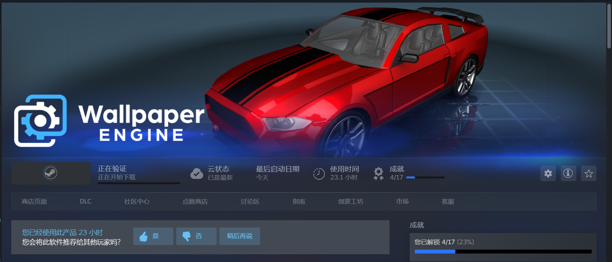

# WallpaperEngine
## 简介

**Wallpaper Engine** 是一款桌面壁纸管理软件，允许用户设置动态壁纸、视频壁纸、3D壁纸以及自定义壁纸，提供了丰富的个性化功能。它支持多种格式的壁纸（如图像、视频、网页等），并且可以根据用户的需求和配置调整壁纸的效果和性能。

#### 核心特点
- **动态壁纸**：支持GIF、视频和HTML等格式的动态壁纸。
- **高自定义性**：可以调整壁纸的运动、声音、亮度等设置。
- **Steam Workshop支持**：用户可以上传和下载其他用户分享的壁纸。
- **低资源占用**：根据硬件性能自动调整壁纸的效果，确保流畅的用户体验。
- **多显示器支持**：可以同时在多个显示器上设置不同的壁纸。
  

---

### Steam版Wallpaper Engine下载壁纸原理

Steam版的 **Wallpaper Engine** 通过Steam Workshop系统下载和管理壁纸。下载壁纸的过程基于以下几个原理：

1. **Steam账户与Workshop关联**：
   - 当用户购买并安装Wallpaper Engine时，它会与Steam账户绑定，用户通过Steam Workshop下载壁纸时，壁纸会被保存在Steam云存储中。

2. **浏览与选择壁纸**：
   - 用户可以通过Steam Workshop浏览各种用户创建和分享的壁纸，选择喜欢的壁纸进行下载。

3. **壁纸文件下载**：
   - 选择并订阅一个壁纸后，Wallpaper Engine会自动从Steam服务器下载该壁纸的文件。这个过程会将壁纸文件保存在本地文件夹中。

4. **壁纸加载与显示**：
   - 下载完成后，用户可以直接在Wallpaper Engine中选择并启用该壁纸。Wallpaper Engine会解析壁纸的格式（如视频、GIF、HTML等）并通过其内置引擎进行渲染和展示。
   - 如果壁纸是视频格式，Wallpaper Engine会通过其优化引擎进行高效播放，确保不会占用过多的系统资源。

5. **更新与管理**：
   - 当用户订阅的壁纸进行更新时，Wallpaper Engine会自动检测并更新本地文件夹中的壁纸，确保用户始终获得最新的内容。
   - 用户也可以在Wallpaper Engine中进行管理，删除不需要的壁纸，或更改壁纸的显示设置。

6. **运行Wallpaper Engine**
   - Wallpaper Engine自身没有steam的验证api，因此用户只要拥有Wallpaper Engine的软件本体与从正版用户手中获得的壁纸，即可获得接近正版用户的体验。

7. **涩涩**  
   - Wallpaper Engine的涩涩内容等待你的发现.....  
  

---

通过这种方式，Wallpaper Engine与Steam Workshop紧密集成，为用户提供了方便快捷的壁纸下载、管理和更新功能。

